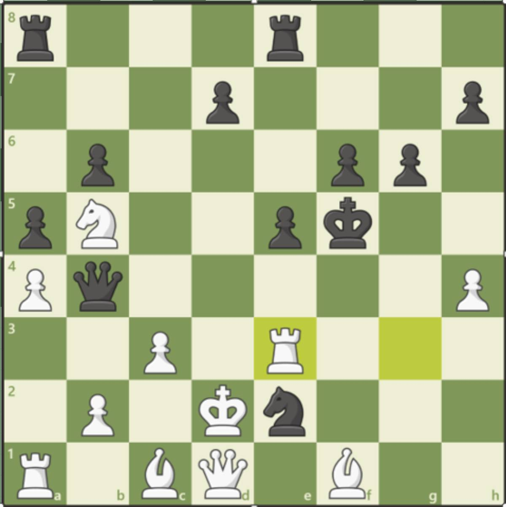

- #Amie rejoins the party
- Vi finder en som overlevede [[Kiboku]] angrebet sidst
	- Han fortæller at de var der for at finde en hemmelig indgang ved foden af det grå bjerg
	- There was a stabbing
- Vi rejser videre rundt om bjerget og finder et bjerg mere
- Bag det bjerg er der et bjerg mere
	- Ved foden af det bjerg er der 6 "stablede" sten
	- Der er kredsmærker fra en drage i stenene
	- Vi får flyttet stenene og kommer ind
		- #Jaylin får en god ide og #Boris bliver presset ind med noget sæbe og vand
	- Inde i grotten er der ternet gulv
		- På vægen er der hugget en fortælling
			- I vægbilledet er der noget der ligner en dør
				- Der er 3 "brevsprækker" ved "døren"
				- Vi sætter 3 harpuner i brevsprækkerne og der lyder et klik
				- Vi får svunget "Døren" op
				- Der står et skak sæt udført i granit på et bord solo i rummet
					- På et af de hvide tårn er udført i rød rubin
					- [Image] Opstillingen af brættet
					  collapsed:: true
						- 
				- Der er en vindeltrappe der leder nedenunder
					- Trappen har et rødt gelænder
					- Der er rum der nede som lader til at ligne skakbrættet